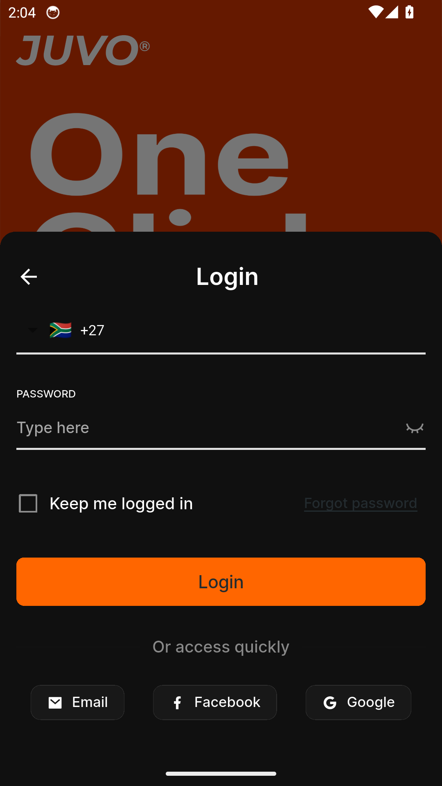
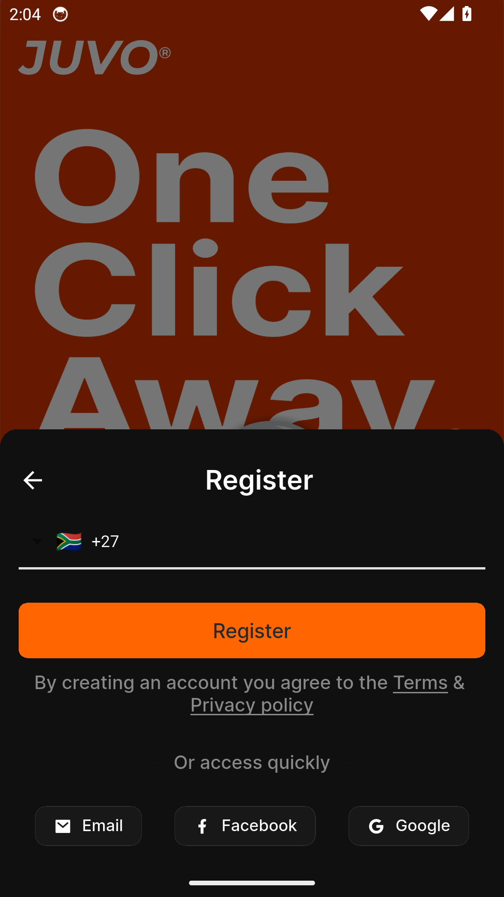
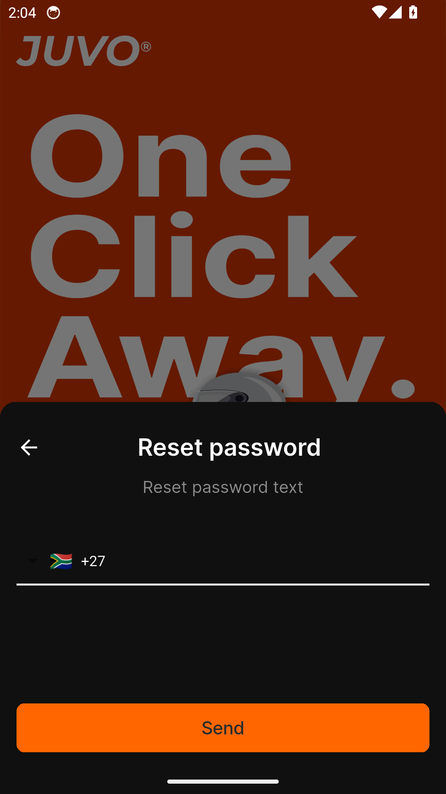
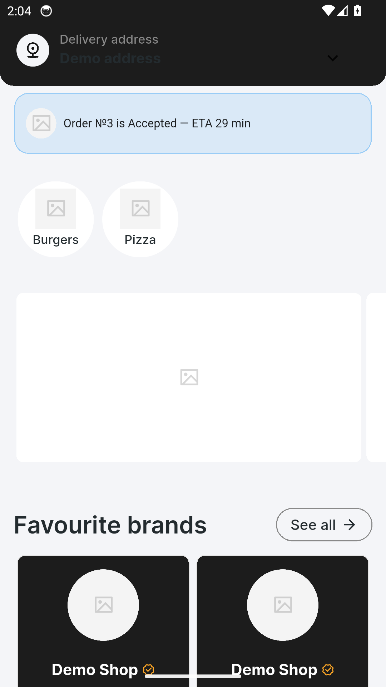
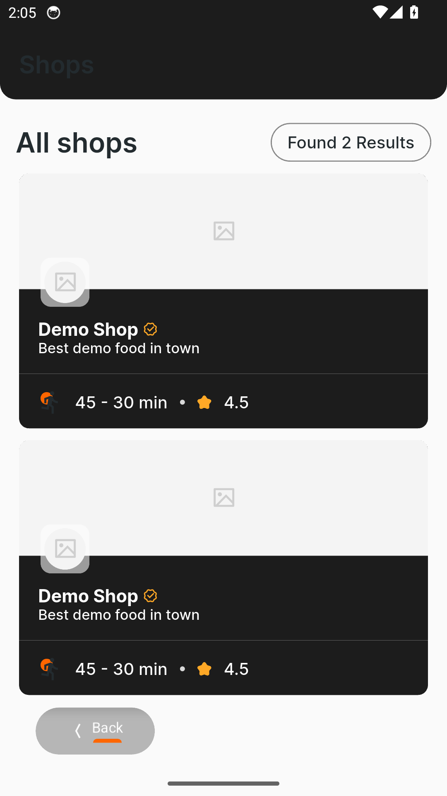
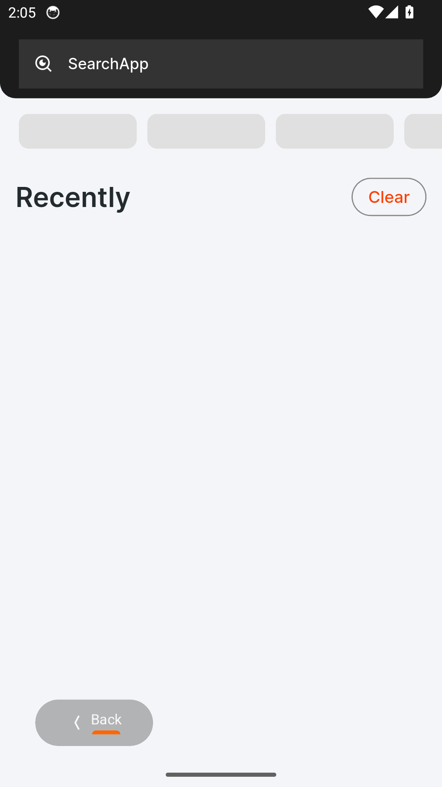
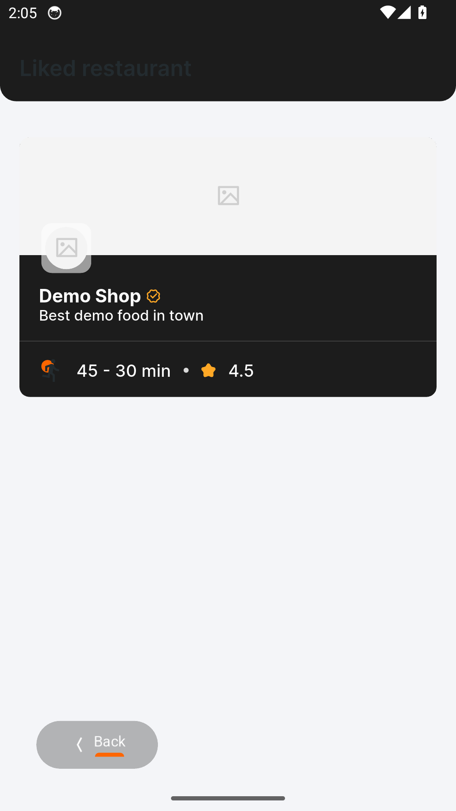

# Juvo — Feature Guide

The multi-store marketplace

> This guide is generated automatically on every merge: CI builds the
> app with its built-in demo dataset, walks the guided tour on an
> Android emulator, and captures each screen below. Content shown is
> demo data.

## 1. Welcome to Juvo

Juvo is every store in one app - and in this demo build, any sign-in details
work.

## 2. Sign in

Signing in to Juvo is quick and simple.

## 3. Create an account

New to Juvo? Create your account in a few easy steps.

## 4. Reset your password

Forgot your password? Juvo gets you back in with a secure reset.

## 5. Every shop, one home

Deals, categories and every local shop on one screen - stocked here by the demo
catalogue.

## 6. Shop by category

Pick a category and see just the shops that stock it.

## 7. Find it fast

One search across shops and products, with filters a tap away.

## 8. Your favourites, kept

Heart a shop once and it waits for you here - your favourites, one tap away.
